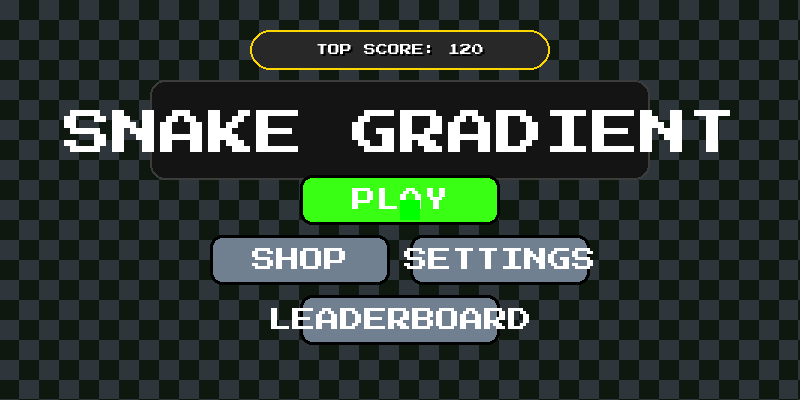
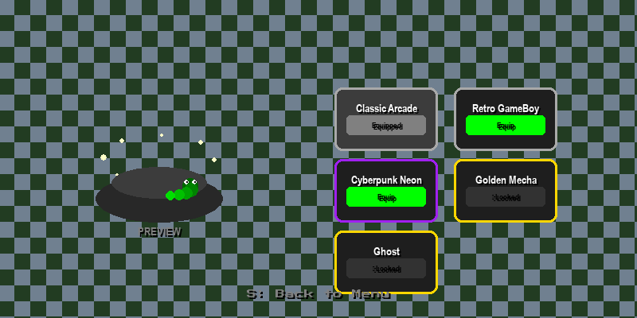
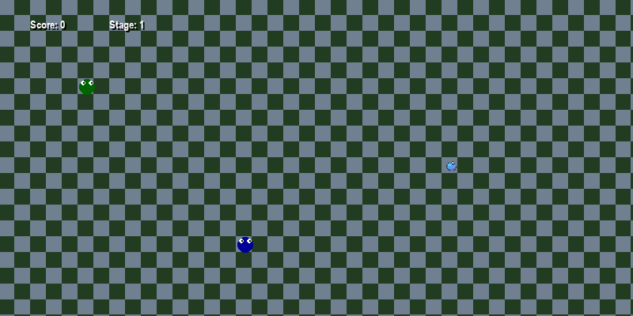
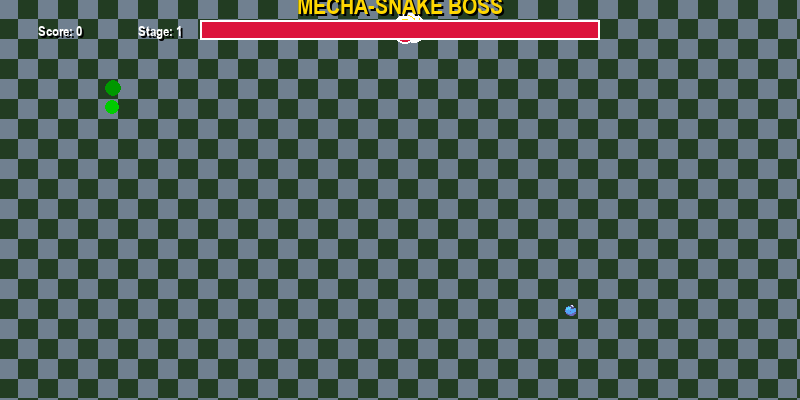

# 🐍 Modular Snake Pro

A premium, modular evolution of the classic Snake game, featuring a robust state-driven architecture, a diverse skin shop, and an advanced AI-driven boss system.

## 🎮 Game Mechanics

- **Multiple Game Modes**: 
  - **Classic**: The timeless experience with escalating speed and boss encounters.
  - **Time Rush**: A high-pressure race against the clock.
  - **Maze Hell**: Start deep in the challenge with advanced stage constraints.
- **Dynamic Skin Shop**: Collect points to unlock high-rarity skins (Common, Epic, Legendary) that change the visual aesthetic of the game.
- **Boss Battles**: Face off against an AI-driven boss snake with unique attack patterns and projectiles.
- **Adaptive Difficulty**: Speed and complexity increase as you progress through stages.

## 🖼️ Visual Previews

| Main Menu | Skin Shop |
| :---: | :---: |
|  |  |

| Gameplay | Boss Battle |
| :---: | :---: |
|  |  |

## 🛠️ Development & Testing Workflow

This project utilizes a **Vision-Based Automated QA Testing Bot** to ensure stability across all game states.

### Automated QA Bot
The `playtest_bot.py` script allows developers to:
- Verify the audio pipeline and asset loading.
- Validate state transitions (Menu $\rightarrow$ Shop $\rightarrow$ Gameplay $\rightarrow$ Boss).
- Test snake movement, growth, and collision logic.
- Generate runtime snapshots for visual auditing.

**To run the test suite:**
```bash
python playtest_bot.py
```

### Production Segregation
To ensure a pure player experience, the automated testing mechanics are strictly segregated:
- **Development Mode**: `playtest_bot.py` is used for CI/CD and local verification.
- **Production Build**: The final standalone executable is compiled from `main.py` only, completely stripping all bot-related event loops and diagnostic scripts. This ensures human players have full manual control from frame one.

## 🚀 Getting Started

### Prerequisites
- Python 3.11+
- Pygame

### Installation
```bash
pip install pygame
```

### Execution
```bash
python main.py